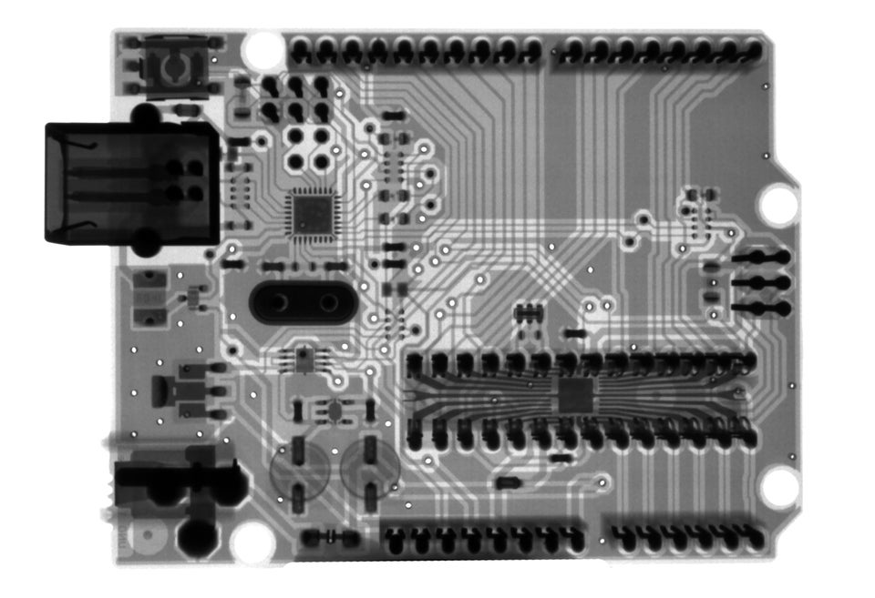
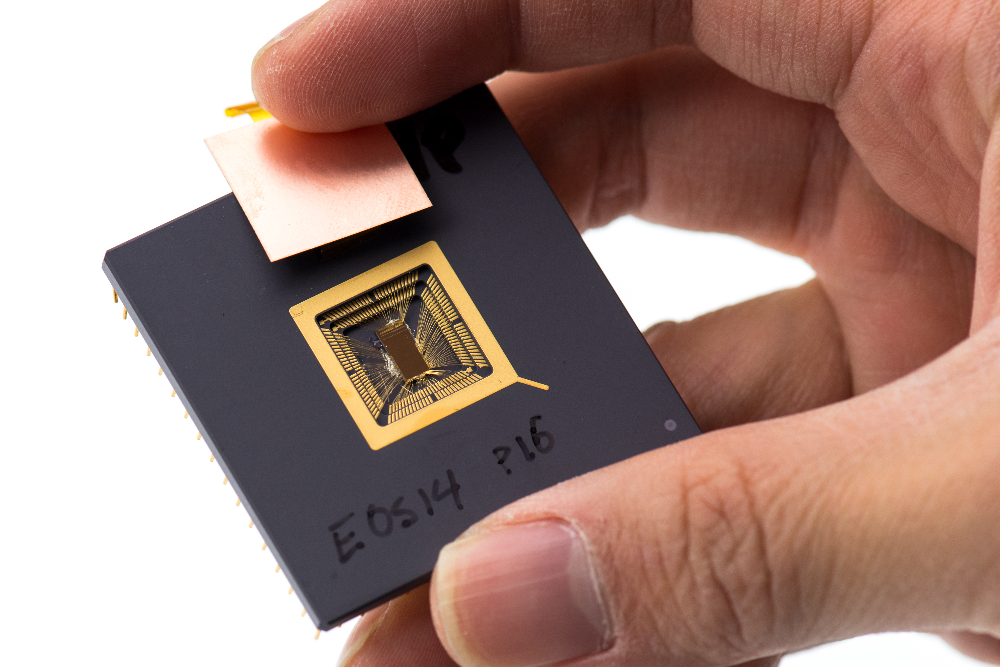

 

  

    

      
    

    

    <h3>Benchmarks</h3>

    

      The Embench&trade; suite is free to use. Each program in the suite is
      open source, and the integration is permissively licensed.

    

    <a href="https://github.com/embench/embench-iot"></a>

    

  

  

    

    <h3>Join</h3>

    

      The Embench&trade; standards group is open for all to join. For now,
      please join our mailing list:

    

    <form class="form-inline justify-content-center" method="post" action="https://lists.librecores.org/mailman/subscribe/embench">
      <input name="email" type="text" class="form-control" placeholder="by E-Mail" aria-label="by E-Mail" aria-describedby="basic-addon1">
      <input name="email-button" type="submit" class="btn btn-primary" value="Subscribe">
    </form>

    

    

      
    

  

